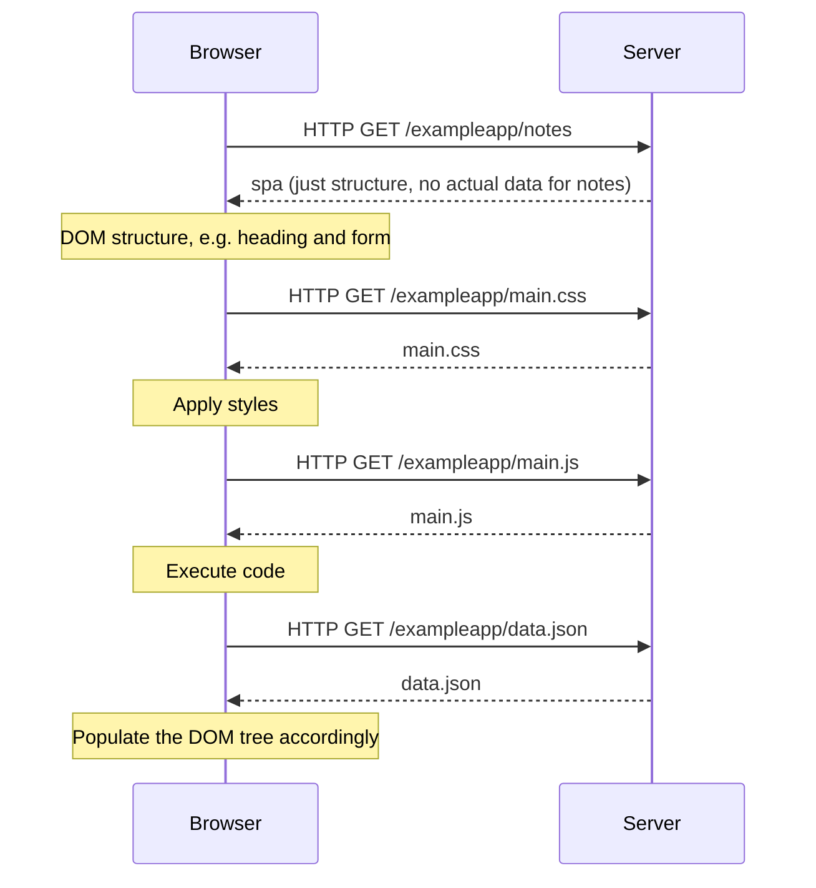

```mermaid
sequenceDiagram
Browser->>Server: HTTP GET /exampleapp/notes
Server-->>Browser: spa (just structure, no actual data for notes)
note over Browser: DOM structure, e.g. heading and form
Browser->>Server: HTTP GET /exampleapp/main.css
Server-->>Browser: main.css
note over Browser: Apply styles
Browser->>Server: HTTP GET /exampleapp/main.js
Server-->>Browser: main.js
note over Browser: Execute code 
Browser->>Server: HTTP GET /exampleapp/data.json
Server-->>Browser: data.json
note over Browser: Populate the DOM tree accordingly
``` 