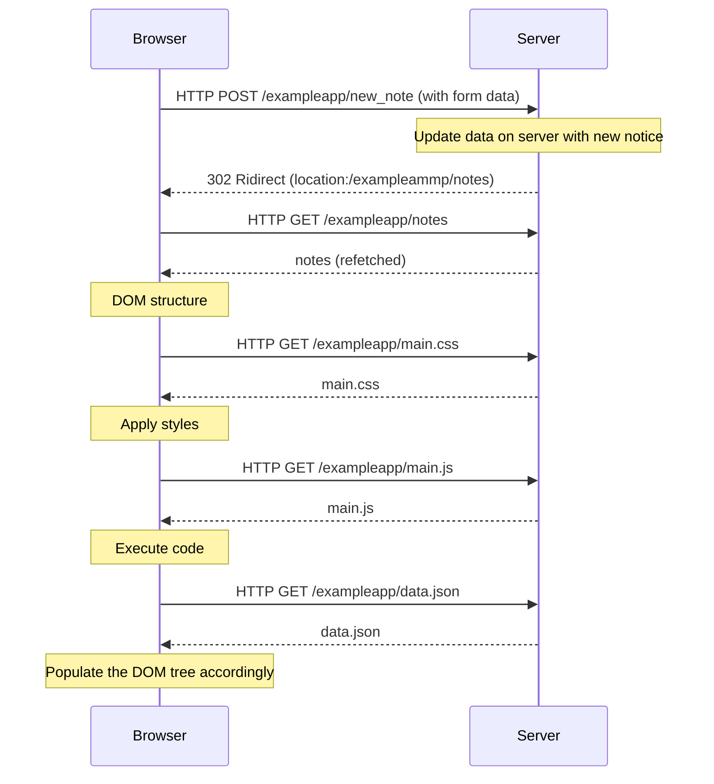

```mermaid
sequenceDiagram
Browser->>Server: HTTP POST /exampleapp/new_note (with form data)
note over Server: Update data on server with new notice
Server-->>Browser: 302 Ridirect (location:/exampleammp/notes)
Browser->>Server: HTTP GET /exampleapp/notes
Server-->>Browser: notes (refetched)
note over Browser: DOM structure
Browser->>Server: HTTP GET /exampleapp/main.css
Server-->>Browser: main.css
note over Browser: Apply styles
Browser->>Server: HTTP GET /exampleapp/main.js
Server-->>Browser: main.js
note over Browser: Execute code
Browser->>Server: HTTP GET /exampleapp/data.json
Server-->>Browser: data.json
note over Browser: Populate the DOM tree accordingly
```
